# 数据库表汇总
> 自动生成时间：2026-08-04 16:00:56
> 数据来源：`数据库设计/init_database.sql` 及 init_is_lab.sql、init_lab_record.sql、migration_20260804_device_repair.sql、backend/scripts/init_data_backup.sql

## 一、总览

共 **22** 张表，按业务模块分组如下：

- **设备管理**：`device`, `device_repair_dispatch_log`, `device_repair_order`, `fault_record`- **业务数据**：`dm_alert_status`, `dm_behavior_type`, `dm_severity_level`, `dm_work_order_status`, `fa_abnormal_behavior`, `fa_behavior_alert`, `fa_work_order`- **轨迹人员**：`dm_anonymous_person`, `track_pass_chain`, `track_pass_item`- **系统日志**：`fa_operation_log`- **用户权限**：`sys_account`, `sys_account_permission`, `sys_permission`, `sys_type_permission`, `sys_user_type`- **数据备份恢复**：`sys_data_backup`, `sys_data_restore_log`## 二、表间连接方式（外键关系）

| 从表 | 从字段 | 关联表 | 关联字段 |
|------|--------|--------|----------|
| `sys_account` | `type_id` | `sys_user_type` | `type_id` |
| `sys_type_permission` | `type_id` | `sys_user_type` | `type_id` |
| `sys_type_permission` | `perm_id` | `sys_permission` | `perm_id` |
| `sys_account_permission` | `account_id` | `sys_account` | `account_id` |
| `sys_account_permission` | `perm_id` | `sys_permission` | `perm_id` |
| `fault_record` | `device_id` | `device` | `id` |
| `track_pass_chain` | `first_device_id` | `device` | `id` |
| `track_pass_chain` | `last_device_id` | `device` | `id` |
| `track_pass_item` | `chain_id` | `track_pass_chain` | `id` |
| `track_pass_item` | `device_id` | `device` | `id` |
| `dm_anonymous_person` | `risk_level_id` | `dm_severity_level` | `severity_level_id` |
| `dm_anonymous_person` | `matched_user_id` | `sys_account` | `account_id` |
| `dm_behavior_type` | `default_severity_level_id` | `dm_severity_level` | `severity_level_id` |
| `fa_abnormal_behavior` | `behavior_type_id` | `dm_behavior_type` | `behavior_type_id` |
| `fa_abnormal_behavior` | `person_id` | `dm_anonymous_person` | `person_id` |
| `fa_abnormal_behavior` | `track_id` | `track_pass_chain` | `id` |
| `fa_abnormal_behavior` | `severity_level_id` | `dm_severity_level` | `severity_level_id` |
| `fa_abnormal_behavior` | `alert_status_id` | `dm_alert_status` | `alert_status_id` |
| `fa_abnormal_behavior` | `camera_id` | `device` | `id` |
| `fa_behavior_alert` | `behavior_id` | `fa_abnormal_behavior` | `behavior_id` |
| `fa_behavior_alert` | `severity_level_id` | `dm_severity_level` | `severity_level_id` |
| `fa_behavior_alert` | `alert_status_id` | `dm_alert_status` | `alert_status_id` |
| `fa_behavior_alert` | `confirmed_by` | `sys_account` | `account_id` |
| `fa_work_order` | `alert_id` | `fa_behavior_alert` | `alert_id` |
| `fa_work_order` | `behavior_id` | `fa_abnormal_behavior` | `behavior_id` |
| `fa_work_order` | `work_order_status_id` | `dm_work_order_status` | `work_order_status_id` |
| `fa_work_order` | `assigned_to` | `sys_account` | `account_id` |
| `fa_work_order` | `assigned_by` | `sys_account` | `account_id` |
| `fa_operation_log` | `operator_id` | `sys_account` | `account_id` |
| `device_repair_order` | `fault_id` | `fault_record` | `id` |
| `device_repair_order` | `device_id` | `device` | `id` |
| `device_repair_dispatch_log` | `order_id` | `device_repair_order` | `id` |
## 三、表结构详情

### 设备管理

#### `device` — 设备表

| 字段 | 类型 | 说明 |
|------|------|------|
| `id` | BIGINT | 自增主键 |
| `device_code` | VARCHAR(64) | 设备标号（业务唯一标识，如 CAM-001） |
| `device_name` | VARCHAR(128) | 设备名称 |
| `device_type` | VARCHAR(32) | 设备类型：CAMERA/NVR/EDGE |
| `location_text` | VARCHAR(255) | 地理位置文本描述（如"A栋3层东侧走廊"） |
| `longitude` | DECIMAL(10 | - |
| `latitude` | DECIMAL(10 | - |
| `region_code` | VARCHAR(32) | 所属区域编码 |
| `region_name` | VARCHAR(64) | 所属区域名称 |
| `status` | VARCHAR(16) | 设备状态：ONLINE/OFFLINE/DISABLED/FAULT |
| `health_score` | TINYINT | 健康度评分 0-100 |
| `video_quality` | VARCHAR(16) | 画面质量：HD/SD/FLUENT/UNKNOWN |
| `last_heartbeat_time` | DATETIME | 最后心跳上报时间 |
| `channel_count` | INT | 通道数 |
| `capability` | JSON | 能力集，如 {"ptz":true,"night_vision":true} |
| `ip_address` | VARCHAR(32) | 设备IP地址 |
| `port` | INT | 端口 |
| `manufacturer` | VARCHAR(64) | 厂商 |
| `model` | VARCHAR(64) | 型号 |
| `firmware_version` | VARCHAR(32) | 固件版本 |
| `install_time` | DATETIME | 安装时间 |
| `operator_id` | BIGINT | 创建/最后修改人ID，关联sys_account.account_id |
| `operator_name` | VARCHAR(64) | 创建/最后修改人姓名 |
| `remark` | VARCHAR(500) | 备注 |
| `is_deleted` | TINYINT | 逻辑删除：0未删除 1已删除 |
| `create_time` | DATETIME | 创建时间 |
| `update_time` | DATETIME | 更新时间 |

**连接方式：**
- 被 `fault_record`.`device_id` 引用
- 被 `track_pass_chain`.`first_device_id` 引用
- 被 `track_pass_chain`.`last_device_id` 引用
- 被 `track_pass_item`.`device_id` 引用
- 被 `fa_abnormal_behavior`.`camera_id` 引用
- 被 `device_repair_order`.`device_id` 引用

#### `device_repair_dispatch_log` — 维修工单派发日志表

| 字段 | 类型 | 说明 |
|------|------|------|
| `id` | BIGINT | 自增主键 |
| `order_id` | BIGINT | 关联维修工单ID，外键→device_repair_order.id |
| `fault_id` | BIGINT | 关联故障记录ID（冗余） |
| `device_id` | BIGINT | 关联设备ID（冗余） |
| `strategy` | VARCHAR(32) | 派发策略：LEAST_LOAD=平均负载（未完成工单最少优先） |
| `candidate_count` | INT | 候选维修人员数量（拥有device:repair权限且启用） |
| `load_snapshot` | JSON | 候选人负载快照，格式 {"账号ID": 未完成工单数} |
| `winner_id` | BIGINT | 中选维修人员ID，关联sys_account.account_id |
| `winner_name` | VARCHAR(64) | 中选维修人员姓名 |
| `result` | VARCHAR(16) | 派发结果：SUCCESS成功/NO_CANDIDATE无候选人员 |
| `remark` | VARCHAR(500) | 备注（如无可派人员原因） |
| `create_time` | DATETIME | 派发时间 |

**连接方式：**
- `order_id` → `device_repair_order`.`id`

#### `device_repair_order` — 设备维修工单表

| 字段 | 类型 | 说明 |
|------|------|------|
| `id` | BIGINT | 自增主键 |
| `order_no` | VARCHAR(32) | 工单编号（业务唯一，如 RO202608040001） |
| `fault_id` | BIGINT | 关联故障记录ID，外键→fault_record.id，唯一（一故障一工单） |
| `device_id` | BIGINT | 关联设备ID，外键→device.id |
| `device_code` | VARCHAR(64) | 设备编号（冗余字段，方便查询） |
| `device_name` | VARCHAR(128) | 设备名称（冗余快照） |
| `status` | VARCHAR(16) | 工单状态：PENDING待处理/REPAIRING维修中/COMPLETED已完成归档 |
| `damage_cause` | VARCHAR(500) | 损坏原因（完成归档必填） |
| `repair_detail` | VARCHAR(500) | 维修情况（完成归档必填） |
| `assigned_to` | BIGINT | 维修人员ID，关联sys_account.account_id；无可派人员时为NULL |
| `assigned_name` | VARCHAR(64) | 维修人员姓名 |
| `dispatch_strategy` | VARCHAR(32) | 派发策略：LEAST_LOAD=平均负载派发 |
| `assigned_at` | DATETIME | 派发时间 |
| `plan_finish_time` | DATETIME | 计划处理时间（默认派发后24小时） |
| `started_at` | DATETIME | 接单/开始维修时间 |
| `completed_at` | DATETIME | 完成归档时间 |
| `operator_id` | BIGINT | 最后操作人ID，关联sys_account.account_id |
| `operator_name` | VARCHAR(64) | 最后操作人姓名 |
| `is_deleted` | TINYINT | 逻辑删除：0未删除 1已删除 |
| `create_time` | DATETIME | 创建时间 |
| `update_time` | DATETIME | 更新时间 |

**连接方式：**
- `fault_id` → `fault_record`.`id`
- `device_id` → `device`.`id`
- 被 `device_repair_dispatch_log`.`order_id` 引用

#### `fault_record` — 故障记录表

| 字段 | 类型 | 说明 |
|------|------|------|
| `id` | BIGINT | 自增主键 |
| `device_id` | BIGINT | 关联设备ID，外键→device.id |
| `device_code` | VARCHAR(64) | 设备标号（冗余字段，方便查询） |
| `fault_type` | VARCHAR(32) | 损坏类型：HEARTBEAT_TIMEOUT/VIDEO_ABNORMAL/… |
| `fault_level` | VARCHAR(16) | 故障级别：LOW/MEDIUM/HIGH/CRITICAL |
| `fault_desc` | VARCHAR(500) | 故障描述 |
| `occurrence_time` | DATETIME | 故障发生时间 |
| `recovery_time` | DATETIME | 故障恢复时间 |
| `auto_recovery_time` | DATETIME | 自动恢复尝试时间 |
| `closed_at` | DATETIME | 故障单关闭时间 |
| `disposal_status` | VARCHAR(16) | 处置状态：PENDING/AUTO_RECOVERED/ASSIGNED/… |
| `assigned_to` | BIGINT | 被指派的维修人员ID，关联sys_account.account_id |
| `assigned_name` | VARCHAR(64) | 被指派的维修人员姓名 |
| `auto_recovery` | TINYINT | 是否尝试过自动恢复：0否 1是 |
| `repair_result` | VARCHAR(16) | 维修结果：PASS复检通过/FAIL复检未通过 |
| `repair_remark` | VARCHAR(500) | 维修备注 |
| `closed_by` | BIGINT | 关闭人ID，关联sys_account.account_id |
| `closed_name` | VARCHAR(64) | 关闭人姓名 |
| `operator_id` | BIGINT | 操作人ID，关联sys_account.account_id |
| `operator_name` | VARCHAR(64) | 操作人姓名 |
| `is_deleted` | TINYINT | 逻辑删除：0未删除 1已删除 |
| `create_time` | DATETIME | 创建时间 |
| `update_time` | DATETIME | 更新时间 |

**连接方式：**
- `device_id` → `device`.`id`
- 被 `device_repair_order`.`fault_id` 引用

### 业务数据

#### `dm_alert_status` — 预警状态（维度表）

| 字段 | 类型 | 说明 |
|------|------|------|
| `alert_status_id` | TINYINT | 主键，固定枚举：1待确认/2已确认/3已派单/4处理中/5已处理/6已忽略 |
| `status_name` | VARCHAR(16) | 中文状态名 |
| `status_sort` | TINYINT | 流转排序 |

**连接方式：**
- 被 `fa_abnormal_behavior`.`alert_status_id` 引用
- 被 `fa_behavior_alert`.`alert_status_id` 引用

#### `dm_behavior_type` — 异常行为类型（维度表）

| 字段 | 类型 | 说明 |
|------|------|------|
| `behavior_type_id` | BIGINT | 异常行为类型ID，自增主键 |
| `type_name` | VARCHAR(64) | 行为类型名称（如：跌倒、打架、闯入、聚集） |
| `default_severity_level_id` | TINYINT | 默认严重程度，引用dm_severity_level.severity_level_id |
| `description` | VARCHAR(255) | 类型说明 |
| `is_enabled` | TINYINT | 是否启用：0否 1是 |
| `create_time` | DATETIME | 创建时间 |
| `update_time` | DATETIME | 更新时间 |

**连接方式：**
- `default_severity_level_id` → `dm_severity_level`.`severity_level_id`
- 被 `fa_abnormal_behavior`.`behavior_type_id` 引用

#### `dm_severity_level` — 严重程度（维度表）

| 字段 | 类型 | 说明 |
|------|------|------|
| `severity_level_id` | TINYINT | 主键，固定枚举：1=高 2=中 3=低 |
| `level_name` | VARCHAR(16) | 等级名称：高/中/低 |
| `level_sort` | TINYINT | 排序，高排最前 |

**连接方式：**
- 被 `dm_anonymous_person`.`risk_level_id` 引用
- 被 `dm_behavior_type`.`default_severity_level_id` 引用
- 被 `fa_abnormal_behavior`.`severity_level_id` 引用
- 被 `fa_behavior_alert`.`severity_level_id` 引用

#### `dm_work_order_status` — 工单状态（维度表）

| 字段 | 类型 | 说明 |
|------|------|------|
| `work_order_status_id` | TINYINT | 主键，固定枚举：1待处理/2处理中/3已完成/4已关闭 |
| `status_name` | VARCHAR(16) | 中文状态名 |
| `status_sort` | TINYINT | 流转排序 |

**连接方式：**
- 被 `fa_work_order`.`work_order_status_id` 引用

#### `fa_abnormal_behavior` — 异常行为记录（核心事实表）

| 字段 | 类型 | 说明 |
|------|------|------|
| `behavior_id` | BIGINT | 异常行为ID，自增主键 |
| `behavior_type_id` | BIGINT | 异常行为类型，引用dm_behavior_type.behavior_type_id |
| `person_id` | BIGINT | 匿名异常人员，引用dm_anonymous_person.person_id |
| `track_id` | BIGINT | 轨迹ID，引用track_pass_chain.id（识别时轨迹可能未生成） |
| `severity_level_id` | TINYINT | 严重程度，引用dm_severity_level.severity_level_id |
| `alert_status_id` | TINYINT | 当前预警状态，引用dm_alert_status.alert_status_id，默认1待确认 |
| `detected_at` | DATETIME | 算法识别时间 |
| `camera_id` | BIGINT | 摄像头ID，引用device.id |
| `confidence_score` | DECIMAL(5 | - |
| `description` | TEXT | 补充描述 |
| `create_time` | DATETIME | 创建时间 |
| `update_time` | DATETIME | 更新时间 |
| `is_lab` | TINYINT | - |

**连接方式：**
- `behavior_type_id` → `dm_behavior_type`.`behavior_type_id`
- `person_id` → `dm_anonymous_person`.`person_id`
- `track_id` → `track_pass_chain`.`id`
- `severity_level_id` → `dm_severity_level`.`severity_level_id`
- `alert_status_id` → `dm_alert_status`.`alert_status_id`
- `camera_id` → `device`.`id`
- 被 `fa_behavior_alert`.`behavior_id` 引用
- 被 `fa_work_order`.`behavior_id` 引用

#### `fa_behavior_alert` — 行为预警（事实表）

| 字段 | 类型 | 说明 |
|------|------|------|
| `alert_id` | BIGINT | 预警ID，自增主键 |
| `behavior_id` | BIGINT | 关联异常行为记录（一对一），引用fa_abnormal_behavior.behavior_id |
| `severity_level_id` | TINYINT | 预警严重度，引用dm_severity_level.severity_level_id |
| `alert_status_id` | TINYINT | 预警状态，引用dm_alert_status.alert_status_id，默认1待确认 |
| `alert_time` | DATETIME | 产生告警时间 |
| `notify_method` | VARCHAR(64) | 通知方式：POPUP/SOUND_LIGHT/PUSH，多值逗号分隔 |
| `confirmed_at` | DATETIME | 确认时间 |
| `confirmed_by` | BIGINT | 确认人用户ID，引用sys_account.account_id |
| `is_marked_focus` | TINYINT | 是否标记重点关注：0否 1是 |
| `resolved_at` | DATETIME | 闭环完成时间 |
| `create_time` | DATETIME | 创建时间 |
| `update_time` | DATETIME | 更新时间 |
| `is_lab` | TINYINT | - |

**连接方式：**
- `behavior_id` → `fa_abnormal_behavior`.`behavior_id`
- `severity_level_id` → `dm_severity_level`.`severity_level_id`
- `alert_status_id` → `dm_alert_status`.`alert_status_id`
- `confirmed_by` → `sys_account`.`account_id`
- 被 `fa_work_order`.`alert_id` 引用

#### `fa_work_order` — 处置工单（事实表）

| 字段 | 类型 | 说明 |
|------|------|------|
| `work_order_id` | BIGINT | 工单ID，自增主键 |
| `work_order_no` | VARCHAR(20) | 工单编号，编码规则：WO+年月日(8位)+4位流水，如WO202507280001 |
| `alert_id` | BIGINT | 关联预警，引用fa_behavior_alert.alert_id |
| `behavior_id` | BIGINT | 关联异常行为，引用fa_abnormal_behavior.behavior_id |
| `work_order_status_id` | TINYINT | 工单状态，引用dm_work_order_status.work_order_status_id，默认1待处理 |
| `assigned_to` | BIGINT | 处理人用户ID，引用sys_account.account_id |
| `handler_role` | VARCHAR(32) | 处理人角色编码 |
| `assigned_by` | BIGINT | 派单人用户ID，引用sys_account.account_id |
| `assigned_at` | DATETIME | 派单时间 |
| `handled_at` | DATETIME | 处理完成时间 |
| `handle_result` | TEXT | 处理结果、措施说明 |
| `handle_duration_minutes` | INT | 处理耗时（分钟） |
| `create_time` | DATETIME | 创建时间 |
| `update_time` | DATETIME | 更新时间 |
| `is_lab` | TINYINT | - |

**连接方式：**
- `alert_id` → `fa_behavior_alert`.`alert_id`
- `behavior_id` → `fa_abnormal_behavior`.`behavior_id`
- `work_order_status_id` → `dm_work_order_status`.`work_order_status_id`
- `assigned_to` → `sys_account`.`account_id`
- `assigned_by` → `sys_account`.`account_id`

### 轨迹人员

#### `dm_anonymous_person` — 匿名异常人员（维度表）

| 字段 | 类型 | 说明 |
|------|------|------|
| `person_id` | BIGINT | 匿名人员ID，自增主键；轨迹表据此ID建轨迹 |
| `appearance_desc` | TEXT | 外形描述：衣着、身高、体型、背包、颜色等 |
| `first_seen_at` | DATETIME | 首次发现时间 |
| `last_seen_at` | DATETIME | 最近一次发现时间 |
| `is_focused` | TINYINT | 是否重点关注：0否 1是 |
| `risk_level_id` | TINYINT | 风险等级，引用dm_severity_level.severity_level_id |
| `matched_user_id` | BIGINT | AI匹配到的用户ID，引用sys_account.account_id（匹配不上则为NULL） |
| `match_confidence` | DECIMAL(5 | - |
| `create_time` | DATETIME | 创建时间 |
| `update_time` | DATETIME | 更新时间 |
| `is_lab` | TINYINT | - |

**连接方式：**
- `risk_level_id` → `dm_severity_level`.`severity_level_id`
- `matched_user_id` → `sys_account`.`account_id`
- 被 `fa_abnormal_behavior`.`person_id` 引用

#### `track_pass_chain` — 人员通行链路主表

| 字段 | 类型 | 说明 |
|------|------|------|
| `id` | BIGINT | 链路主键ID |
| `chain_unique_id` | VARCHAR(64) | 链路唯一编号，前端传参标识 |
| `person_id` | BIGINT | 人员档案ID，关联dm_anonymous_person.person_id；陌生人则为NULL |
| `confidence` | DECIMAL(5 | - |
| `device_route` | VARCHAR(256) | 摄像头路径串，分隔符-，示例：1001-1002-1003 |
| `first_device_id` | BIGINT | 首个摄像头设备ID，关联device.id |
| `last_device_id` | BIGINT | 末尾摄像头设备ID，关联device.id |
| `chain_start_time` | DATETIME(3) | 人员第一次被摄像头抓拍的时间 |
| `chain_end_time` | DATETIME(3) | 轨迹结束时间；行进中为NULL |
| `total_duration_sec` | INT | 全程总耗时（秒） |
| `chain_status` | TINYINT | 链路状态：1=行进中 2=轨迹归档完成 |
| `create_time` | DATETIME | 记录创建时间 |
| `update_time` | DATETIME | 记录更新时间 |
| `is_lab` | TINYINT | - |

**连接方式：**
- `first_device_id` → `device`.`id`
- `last_device_id` → `device`.`id`
- 被 `track_pass_item`.`chain_id` 引用
- 被 `fa_abnormal_behavior`.`track_id` 引用

#### `track_pass_item` — 途经摄像头明细子表

| 字段 | 类型 | 说明 |
|------|------|------|
| `id` | BIGINT | 明细主键ID |
| `chain_id` | BIGINT | 所属链路ID，关联track_pass_chain.id |
| `device_id` | BIGINT | 当前摄像头设备ID，关联device.id |
| `sort` | TINYINT | 途经顺序号：1、2、3… |
| `appear_time` | DATETIME(3) | 进入摄像头画面时间 |
| `disappear_time` | DATETIME(3) | 离开摄像头画面时间；未离开则为NULL |
| `stay_duration_sec` | INT | 本段停留时长（秒） |
| `create_time` | DATETIME | 明细创建时间 |

**连接方式：**
- `chain_id` → `track_pass_chain`.`id`
- `device_id` → `device`.`id`

### 系统日志

#### `fa_operation_log` — 操作日志（事实表）

| 字段 | 类型 | 说明 |
|------|------|------|
| `log_id` | BIGINT | 日志ID，自增主键 |
| `module_code` | VARCHAR(32) | 模块编码：ABNORMAL_BEHAVIOR/BACKUP_RESTORE/USER_PROFILE |
| `operation_type` | VARCHAR(32) | 操作类型：QUERY/EXPORT/BACKUP/RESTORE/UPDATE/DELETE |
| `operator_id` | BIGINT | 操作人用户ID，引用sys_account.account_id |
| `operator_role` | VARCHAR(32) | 操作人角色编码（按当前值快照） |
| `target_id` | BIGINT | 被操作对象ID |
| `target_type` | VARCHAR(32) | 对象类型：BEHAVIOR/USER/BACKUP |
| `operation_content` | JSON | 操作详情（查询条件/导出范围/变更前后值） |
| `ip_address` | VARCHAR(64) | 操作IP地址 |
| `operated_at` | DATETIME | 操作时间 |
| `create_time` | DATETIME | 创建时间 |

**连接方式：**
- `operator_id` → `sys_account`.`account_id`

### 用户权限

#### `sys_account` — 系统账号表

| 字段 | 类型 | 说明 |
|------|------|------|
| `account_id` | BIGINT | 账号唯一标识 |
| `login_name` | VARCHAR(64) | 用户登录用户名，全局唯一 |
| `password` | VARCHAR(128) | 加密存储密码 |
| `real_name` | VARCHAR(64) | 用户真实姓名 |
| `dept` | VARCHAR(64) | 部门信息 |
| `phone` | VARCHAR(32) | 用户联系电话 |
| `type_id` | BIGINT | 所属用户类型ID，关联sys_user_type.type_id |
| `status` | TINYINT | 账号状态：1=启用 0=禁用 |
| `create_time` | DATETIME | 账号创建时间 |
| `update_time` | DATETIME | 账号信息更新时间 |
| `last_login_time` | DATETIME | 用户最近一次登录时间 |

**连接方式：**
- `type_id` → `sys_user_type`.`type_id`
- 被 `sys_account_permission`.`account_id` 引用
- 被 `dm_anonymous_person`.`matched_user_id` 引用
- 被 `fa_behavior_alert`.`confirmed_by` 引用
- 被 `fa_work_order`.`assigned_to` 引用
- 被 `fa_work_order`.`assigned_by` 引用
- 被 `fa_operation_log`.`operator_id` 引用

#### `sys_account_permission` — 账号独立权限关联表（单人自定义权限）

| 字段 | 类型 | 说明 |
|------|------|------|
| `id` | BIGINT | 关联记录唯一ID |
| `account_id` | BIGINT | 账号ID，关联sys_account.account_id |
| `perm_id` | BIGINT | 权限ID，关联sys_permission.perm_id |

**连接方式：**
- `account_id` → `sys_account`.`account_id`
- `perm_id` → `sys_permission`.`perm_id`

#### `sys_permission` — 权限资源表

| 字段 | 类型 | 说明 |
|------|------|------|
| `perm_id` | BIGINT | 权限唯一编号 |
| `perm_name` | VARCHAR(128) | 权限展示名称，例：摄像头查询 |
| `perm_key` | VARCHAR(128) | 程序鉴权编码，例：camera:query |
| `perm_type` | TINYINT | 1=菜单权限 2=按钮操作权限 3=数据查询权限 |
| `parent_id` | BIGINT | 父权限ID，0代表顶级权限 |
| `sort` | INT | 前端权限树形展示排序 |
| `create_time` | DATETIME | 权限记录创建时间 |

**连接方式：**
- 被 `sys_type_permission`.`perm_id` 引用
- 被 `sys_account_permission`.`perm_id` 引用

#### `sys_type_permission` — 用户类型权限关联表（角色权限）

| 字段 | 类型 | 说明 |
|------|------|------|
| `id` | BIGINT | 关联记录唯一ID |
| `type_id` | BIGINT | 用户类型ID，关联sys_user_type.type_id |
| `perm_id` | BIGINT | 权限ID，关联sys_permission.perm_id |

**连接方式：**
- `type_id` → `sys_user_type`.`type_id`
- `perm_id` → `sys_permission`.`perm_id`

#### `sys_user_type` — 用户类型表（角色表）

| 字段 | 类型 | 说明 |
|------|------|------|
| `type_id` | BIGINT | 用户类型唯一标识 |
| `type_name` | VARCHAR(64) | 角色名称，如：超级管理员、保安、业务员 |
| `type_desc` | VARCHAR(256) | 用户类型备注说明 |
| `create_time` | DATETIME | 记录创建时间 |
| `update_time` | DATETIME | 记录更新时间 |

**连接方式：**
- 被 `sys_account`.`type_id` 引用
- 被 `sys_type_permission`.`type_id` 引用

### 数据备份恢复

#### `sys_data_backup` — 数据备份记录

| 字段 | 类型 | 说明 |
|------|------|------|
| `backup_id` | BIGINT | - |
| `backup_name` | VARCHAR(128) | 备份名称 |
| `backup_type` | VARCHAR(16) | 备份类型 MANUAL/AUTO |
| `strategy_desc` | VARCHAR(255) | 备份策略说明（自动备份时填写周期） |
| `file_path` | VARCHAR(512) | 备份文件相对路径 |
| `file_size` | BIGINT | 备份文件字节数 |
| `status` | VARCHAR(16) | SUCCESS/FAILED/RESTORED |
| `operator_id` | BIGINT | 操作人账号ID |
| `operator_name` | VARCHAR(64) | 操作人姓名 |
| `create_time` | DATETIME | 创建时间 |

#### `sys_data_restore_log` — 数据恢复日志

| 字段 | 类型 | 说明 |
|------|------|------|
| `restore_id` | BIGINT | - |
| `backup_id` | BIGINT | 来源备份ID |
| `backup_name` | VARCHAR(128) | 来源备份名称（冗余快照） |
| `restore_status` | VARCHAR(16) | SUCCESS/FAILED |
| `result_msg` | VARCHAR(500) | 恢复结果说明 |
| `operator_id` | BIGINT | - |
| `operator_name` | VARCHAR(64) | - |
| `restore_time` | DATETIME | 恢复时间 |

## 四、ER 图（Mermaid）

```mermaid
erDiagram
    sys_user_type {
        int type_id
        string type_name
        string type_desc
        datetime create_time
        datetime update_time
    }
    sys_permission {
        int perm_id
        string perm_name
        string perm_key
        int perm_type
        int parent_id
        int sort
        datetime create_time
    }
    sys_account {
        int account_id
        string login_name
        string password
        string real_name
        string dept
        string phone
        int type_id
        int status
        datetime create_time
        datetime update_time
        datetime last_login_time
    }
    sys_type_permission {
        int id
        int type_id
        int perm_id
    }
    sys_account_permission {
        int id
        int account_id
        int perm_id
    }
    device {
        int id
        string device_code
        string device_name
        string device_type
        string location_text
        int longitude
        int latitude
        string region_code
        string region_name
        string status
        int health_score
        string video_quality
        datetime last_heartbeat_time
        int channel_count
        string capability
        string ip_address
        int port
        string manufacturer
        string model
        string firmware_version
        datetime install_time
        int operator_id
        string operator_name
        string remark
        int is_deleted
        datetime create_time
        datetime update_time
    }
    fault_record {
        int id
        int device_id
        string device_code
        string fault_type
        string fault_level
        string fault_desc
        datetime occurrence_time
        datetime recovery_time
        datetime auto_recovery_time
        datetime closed_at
        string disposal_status
        int assigned_to
        string assigned_name
        int auto_recovery
        string repair_result
        string repair_remark
        int closed_by
        string closed_name
        int operator_id
        string operator_name
        int is_deleted
        datetime create_time
        datetime update_time
    }
    track_pass_chain {
        int id
        string chain_unique_id
        int person_id
        int confidence
        string device_route
        int first_device_id
        int last_device_id
        datetime chain_start_time
        datetime chain_end_time
        int total_duration_sec
        int chain_status
        datetime create_time
        datetime update_time
        int is_lab
    }
    track_pass_item {
        int id
        int chain_id
        int device_id
        int sort
        datetime appear_time
        datetime disappear_time
        int stay_duration_sec
        datetime create_time
    }
    dm_severity_level {
        int severity_level_id
        string level_name
        int level_sort
    }
    dm_alert_status {
        int alert_status_id
        string status_name
        int status_sort
    }
    dm_work_order_status {
        int work_order_status_id
        string status_name
        int status_sort
    }
    dm_anonymous_person {
        int person_id
        string appearance_desc
        datetime first_seen_at
        datetime last_seen_at
        int is_focused
        int risk_level_id
        int matched_user_id
        int match_confidence
        datetime create_time
        datetime update_time
        int is_lab
    }
    dm_behavior_type {
        int behavior_type_id
        string type_name
        int default_severity_level_id
        string description
        int is_enabled
        datetime create_time
        datetime update_time
    }
    fa_abnormal_behavior {
        int behavior_id
        int behavior_type_id
        int person_id
        int track_id
        int severity_level_id
        int alert_status_id
        datetime detected_at
        int camera_id
        int confidence_score
        string description
        datetime create_time
        datetime update_time
        int is_lab
    }
    fa_behavior_alert {
        int alert_id
        int behavior_id
        int severity_level_id
        int alert_status_id
        datetime alert_time
        string notify_method
        datetime confirmed_at
        int confirmed_by
        int is_marked_focus
        datetime resolved_at
        datetime create_time
        datetime update_time
        int is_lab
    }
    fa_work_order {
        int work_order_id
        string work_order_no
        int alert_id
        int behavior_id
        int work_order_status_id
        int assigned_to
        string handler_role
        int assigned_by
        datetime assigned_at
        datetime handled_at
        string handle_result
        int handle_duration_minutes
        datetime create_time
        datetime update_time
        int is_lab
    }
    fa_operation_log {
        int log_id
        string module_code
        string operation_type
        int operator_id
        string operator_role
        int target_id
        string target_type
        string operation_content
        string ip_address
        datetime operated_at
        datetime create_time
    }
    device_repair_order {
        int id
        string order_no
        int fault_id
        int device_id
        string device_code
        string device_name
        string status
        string damage_cause
        string repair_detail
        int assigned_to
        string assigned_name
        string dispatch_strategy
        datetime assigned_at
        datetime plan_finish_time
        datetime started_at
        datetime completed_at
        int operator_id
        string operator_name
        int is_deleted
        datetime create_time
        datetime update_time
    }
    device_repair_dispatch_log {
        int id
        int order_id
        int fault_id
        int device_id
        string strategy
        int candidate_count
        string load_snapshot
        int winner_id
        string winner_name
        string result
        string remark
        datetime create_time
    }
    sys_data_backup {
        int backup_id
        string backup_name
        string backup_type
        string strategy_desc
        string file_path
        int file_size
        string status
        int operator_id
        string operator_name
        datetime create_time
    }
    sys_data_restore_log {
        int restore_id
        int backup_id
        string backup_name
        string restore_status
        string result_msg
        int operator_id
        string operator_name
        datetime restore_time
    }
    sys_account ||--o{ sys_user_type : "type_id"
    sys_type_permission ||--o{ sys_user_type : "type_id"
    sys_type_permission ||--o{ sys_permission : "perm_id"
    sys_account_permission ||--o{ sys_account : "account_id"
    sys_account_permission ||--o{ sys_permission : "perm_id"
    fault_record ||--o{ device : "device_id"
    track_pass_chain ||--o{ device : "first_device_id"
    track_pass_chain ||--o{ device : "last_device_id"
    track_pass_item ||--o{ track_pass_chain : "chain_id"
    track_pass_item ||--o{ device : "device_id"
    dm_anonymous_person ||--o{ dm_severity_level : "risk_level_id"
    dm_anonymous_person ||--o{ sys_account : "matched_user_id"
    dm_behavior_type ||--o{ dm_severity_level : "default_severity_level_id"
    fa_abnormal_behavior ||--o{ dm_behavior_type : "behavior_type_id"
    fa_abnormal_behavior ||--o{ dm_anonymous_person : "person_id"
    fa_abnormal_behavior ||--o{ track_pass_chain : "track_id"
    fa_abnormal_behavior ||--o{ dm_severity_level : "severity_level_id"
    fa_abnormal_behavior ||--o{ dm_alert_status : "alert_status_id"
    fa_abnormal_behavior ||--o{ device : "camera_id"
    fa_behavior_alert ||--o{ fa_abnormal_behavior : "behavior_id"
    fa_behavior_alert ||--o{ dm_severity_level : "severity_level_id"
    fa_behavior_alert ||--o{ dm_alert_status : "alert_status_id"
    fa_behavior_alert ||--o{ sys_account : "confirmed_by"
    fa_work_order ||--o{ fa_behavior_alert : "alert_id"
    fa_work_order ||--o{ fa_abnormal_behavior : "behavior_id"
    fa_work_order ||--o{ dm_work_order_status : "work_order_status_id"
    fa_work_order ||--o{ sys_account : "assigned_to"
    fa_work_order ||--o{ sys_account : "assigned_by"
    fa_operation_log ||--o{ sys_account : "operator_id"
    device_repair_order ||--o{ fault_record : "fault_id"
    device_repair_order ||--o{ device : "device_id"
    device_repair_dispatch_log ||--o{ device_repair_order : "order_id"
```

